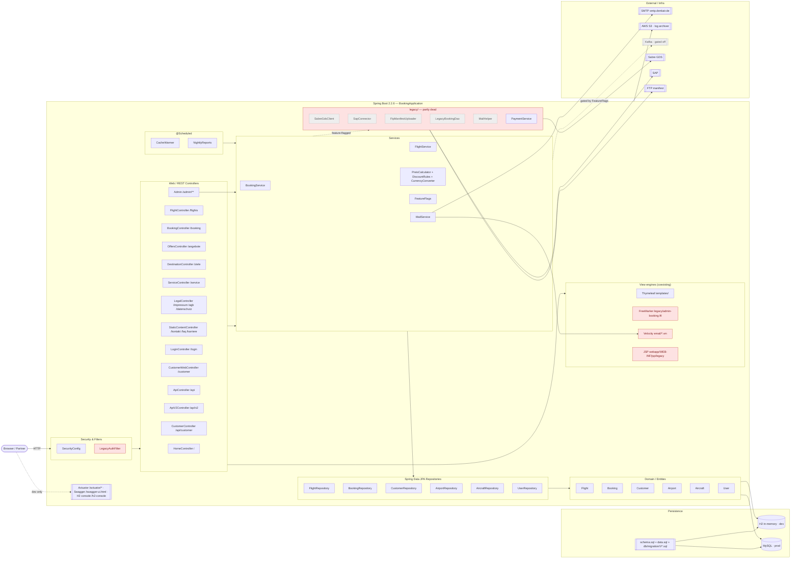
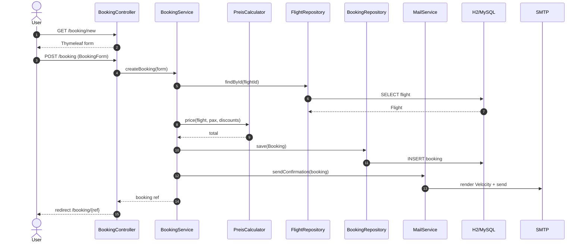
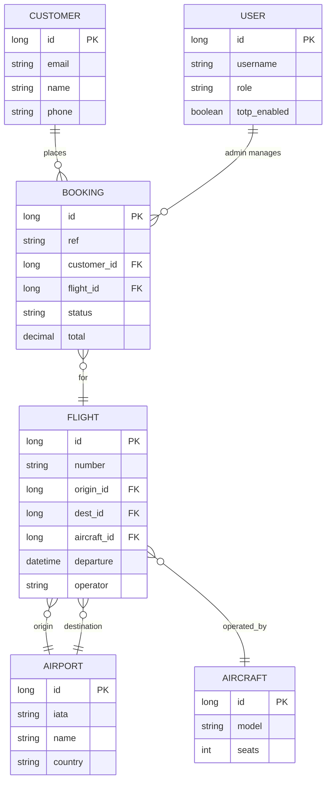

# DenkAir Booking — Architecture

A workshop brownfield codebase: a Spring Boot online booking portal ("DenkAir") with a historically-grown mix of modern Spring MVC, legacy JSP/FreeMarker/Velocity, vestigial integrations, and dead dependencies.

## System overview

### Booking request flow

### Domain model (ER sketch)

## Stack

- **Runtime:** Java 8 source target (pom), but Dockerfile builds/runs on Temurin 17
- **Framework:** Spring Boot `2.2.6.RELEASE` (Web + Thymeleaf + Data JPA + JDBC + Security + Validation + Actuator + Mail)
- **Persistence:** Spring Data JPA / Hibernate; H2 in-memory by default (`jdbc:h2:mem:denkair`, MySQL mode), MySQL connector present for prod; H2 console exposed at `/h2-console`
- **Schema:** `src/main/resources/schema.sql` + `data.sql` on startup; `src/main/resources/db/migration/V*.sql` holds 40+ Flyway-style scripts (non-sequential numbering — see "Smells")
- **View layers (coexisting):** Thymeleaf (`src/main/resources/templates/**`), FreeMarker `legacy/admin-booking.ftl`, Velocity `email/booking-confirmation.vm`, JSP `src/main/webapp/WEB-INF/jsp/legacy/old-booking.jsp`
- **API docs:** Springfox Swagger 2.9.2 at `/swagger-ui.html`
- **Build:** Maven (wrapper included); `Makefile` with `run/start/stop/restart/status/logs/probe/tests/scan-secrets` targets
- **Deployment:** Multi-stage `Dockerfile` (Maven 3.9 → Temurin 17 JRE, non-root user `denkair`), `docker-compose.yml`, Railway via `railway.toml` (health at `/actuator/health`)

## Entry point

`de.denkair.booking.BookingApplication` (`@SpringBootApplication`, `@EnableScheduling`) — `src/main/java/de/denkair/booking/BookingApplication.java:9`.

A second root package `de.denkair.fluginfo` contains `FlugInfoBean` + `FlugInfoService` (older flight-info service being migrated; see `V8__migrate_fluginfo_to_flight.sql`).

## Package layout (`de.denkair.booking`)

| Package | Purpose |
|---|---|
| `config/` | `SecurityConfig`, `SwaggerConfig`, `WebConfig` |
| `controller/` | Public web + REST controllers |
| `controller/admin/` | `AdminDashboardController`, `FlightAdminController` (`/admin/**`) |
| `controller/v2/` | `ApiV2Controller` (`/api/v2`) |
| `domain/` | JPA entities: `Aircraft`, `Airport`, `Booking`, `Customer`, `Flight`, `User` |
| `dto/` | `BookingForm`, `FlightDto`, `FlightSearchForm` |
| `repository/` | Spring Data repositories for each entity |
| `service/` | `BookingService`, `FlightService`, `MailService`, `PreisCalculator`, `DiscountRules`, `CurrencyConverter`, `FeatureFlags` |
| `scheduled/` | `CacheWarmer`, `NightlyReports` (`@Scheduled`) |
| `filter/` | `LegacyAuthFilter` |
| `legacy/` | `SabreGdsClient`, `SapConnector`, `FtpManifestUploader`, `LegacyBookingDao`, `MailHelper`, `PaymentService`, `Constants` — older integrations, partly dead |
| `util/` | `DateHelper`, `DateUtil`, `DateUtils`, `StringUtil` (three date utils — intentional) |

## HTTP surface

Public site (Thymeleaf):

- `GET /`, `/home` — `HomeController`
- `GET /flights`, `/flights/{id}` — `FlightController` (V2 exists but is commented out, only `/v2/flights/ping` is live)
- `GET /angebote` — `OffersController`
- `GET /ziele`, `/ziele/{slug}` — `DestinationController`
- `GET /service`, `/service/check-in`, `/service/gepaeck`, `/service/mein-flug` — `ServiceController`
- `GET /impressum`, `/datenschutz`, `/agb` — `LegalController`
- `GET /kontakt`, `/faq`, `/karriere` — `StaticContentController`
- `GET /login` — `LoginController`
- `GET /customer/bookings` — `CustomerWebController`

Booking flow:

- `GET /booking/new`, `POST /booking`, `GET /booking/{ref}` — `BookingController`
- `GET /flights/api/search?origin=…&destination=…` — JSON search

REST APIs:

- `/api/**` — `ApiController` (`GET /api/flights`, `GET /api/bookings/by-email/{email}`)
- `/api/customer/**` — `CustomerController` (`/me`, `/{email}`)
- `/api/v2/flights` — `ApiV2Controller`

Admin (`/admin/**`): `AdminDashboardController`, `FlightAdminController` (incl. `GET /admin/flights/{id}/delete` — non-idempotent GET).

Infra: Actuator (`management.endpoints.web.exposure.include=*`, health details always on), Swagger UI, H2 console.

## Domain model

Core entities and their foreign keys (inferred from migrations `V1`, `V3`, `V6`, `V7`, `V9`, `V143`):
`Customer` — `Booking` *(N:1)* — `Flight` *(N:1)* — `Airport` (origin/destination) and `Aircraft`. `User` holds staff/admin accounts (added in `V10`, 2FA fields in `V55`).

## Scheduling & background

- `CacheWarmer` — warms caches on boot/interval
- `NightlyReports` — nightly export (Quartz dependency is present but unused; `@Scheduled` is what actually runs)

## Tests

`src/test/java/de/denkair/booking/` — controller IT (`BookingControllerIT`, `HomeControllerTest`), service unit tests (`BookingServiceTest`, `FlightServiceTest`, `DiscountRulesTest`, `PreisCalculatorTest`), `PaymentServiceTest`, date-util tests. JUnit 4 + 5 coexist (see pom comment). `make tests` prints a brownfield report of `@Ignore`/`@Disabled`/TODO tests.

## Deployment

1. `mvn package` → `target/booking-0.0.1-SNAPSHOT.jar`
2. Docker image runs as uid 1001, `JAVA_OPTS="-XX:+UseContainerSupport -XX:MaxRAMPercentage=75"`, port `${PORT:-8080}`
3. Railway uses the same Dockerfile; healthcheck `/actuator/health`, max 3 restarts on failure

## Notable smells (workshop-relevant)

- **Spring Boot 2.2.6** — EOL; CVE exposure. Java 8 source on a JDK 17 runtime.
- **Duplicate libs on classpath:** `commons-lang` 2.6 + `commons-lang3` 3.9; `commons-httpclient` 3.1 + `httpclient` 4.5.6; three in-house date utils.
- **Pinned-for-fear versions:** Guava 20.0 frozen since a Springfox `NoSuchMethodError`; `jackson-databind` 2.10.2 pinned "don't remove".
- **Dead weight:** Quartz (replaced by `@Scheduled`), EHCache (unused since 2019), Jackrabbit (abandoned CMS), Kafka client (gated off in `FeatureFlags`), HSQLDB (ghost test DB), log4j 1.x alongside logback.
- **Secrets in `application.properties`:** SMTP password committed in plaintext (`Mail2019!`); `.trufflehogignore` was added to silence scans — treat as a workshop exercise, not a pattern.
- **Actuator wide open** (`include=*`, full health details), **H2 console allows remote access** (`web-allow-others=true`).
- **Migration numbering is non-monotonic** (`V112`, `V143`, `V201`, `V247` interleaved with `V20..V23`) — production hotfixes backported out of order. `V30__drop_paymetric_meta_ATTEMPT.sql` suggests a failed migration left in tree.
- **Mixed view tech:** Thymeleaf + FreeMarker + Velocity + JSP under `webapp/WEB-INF` alongside jar-packaged resources.
- **Legacy package** contains direct SAP/Sabre/FTP integrations and a hand-rolled `LegacyBookingDao` — candidates for extraction or deletion.
- **Non-idempotent `GET /admin/flights/{id}/delete`.**
- **Dual auth paths:** `SecurityConfig` + `LegacyAuthFilter`.
- **TODO/Ticket breadcrumbs** in pom comments (HA-438, HA-1540) — historical backlog never closed.

## Where to start reading

1. `BookingApplication.java` → `controller/HomeController.java`, `FlightController.java`, `BookingController.java`
2. `service/BookingService.java` + `PreisCalculator.java` for the booking/pricing flow
3. `db/migration/V1__initial_schema.sql` + `V3__add_booking.sql` for the data model
4. `legacy/` package last — most of it is reachable only through feature flags or dead code paths
